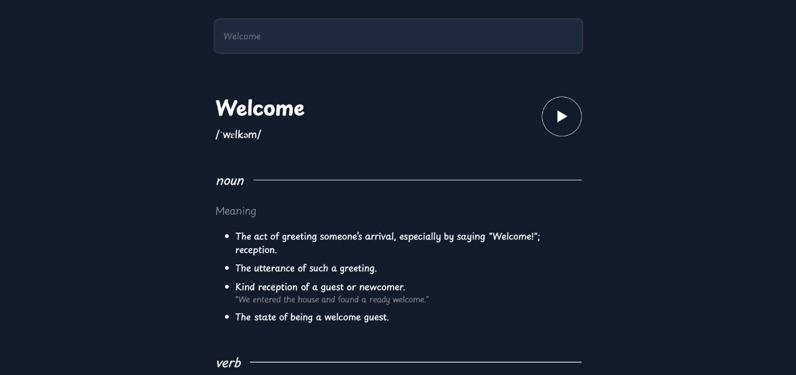

# Dictionary React App

.


This is an application built using React that enables users to search for word definitions and related information. It leverages the [dictionaryapi.dev](https;//dictionaryapi.dev/) API to fetch word definitions.

## Key Features

 **Word Definitions;** Instantly search, for word definitions.
 **Pronunciation;** Listen to the pronunciation of the searched word.
 **Part of Speech;** Discover the part of speech of a word.
 **Synonyms and Antonyms;** Explore. Antonyms, for a given word.

## Demo

Feel free to check out the demo of this application hosted on [GitHub Pages](https;//your github username.github.io/your repo name).

## Getting Started

To run this project or make any improvements follow these steps;

1. **Clone the repository;**

```bash
git clone https;//github.com/your github username/your repo name.git
